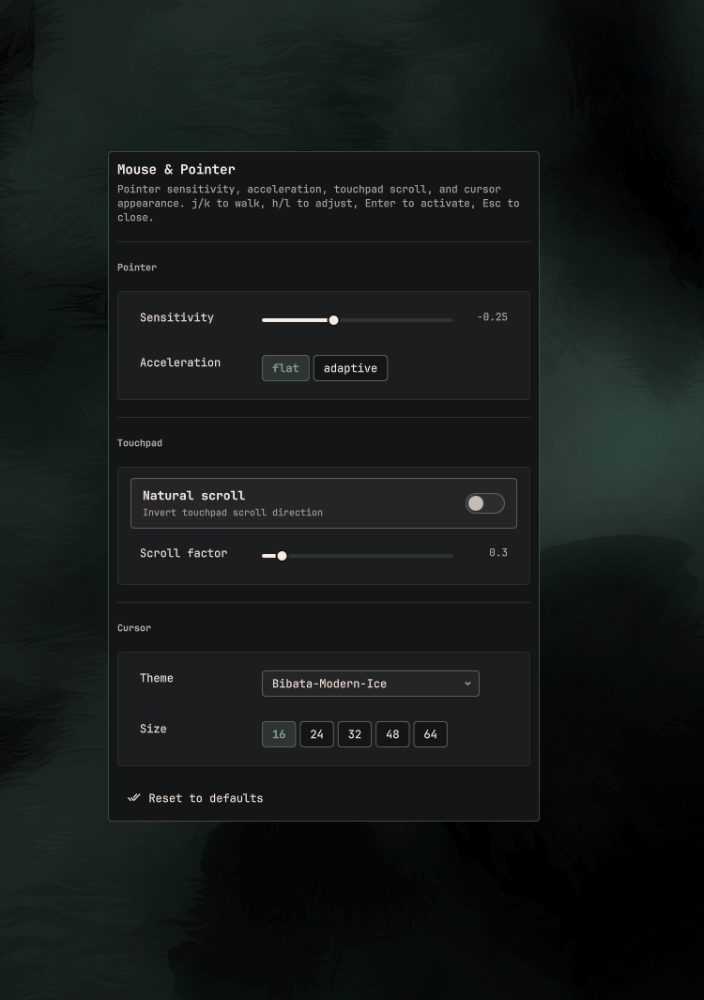

# oxhenri.mouse

Mouse and pointer settings panel for [Omarchy](https://github.com/basecamp/omarchy) (Quickshell).



Open it from **Setup → Mouse**.

- Pointer sensitivity and acceleration profile (`flat` / `adaptive`)
- Touchpad natural scroll and scroll factor
- Cursor theme (hyprcursor and legacy XCursor themes) and cursor size

Changes apply immediately via `hyprctl` and persist through an Omarchy
hyprland-toggles lua file (`~/.local/state/omarchy/toggles/hypr/oxhenri-mouse.lua`)
so they survive reloads, in the same way `omarchy-hyprland-toggle` persists state.
Your existing Hyprland config files are never modified.

## Install

```sh
omarchy plugin add https://github.com/Dev-Herni/oxhenri.mouse.git --enable
```

Add this line to `~/.config/omarchy/extensions/omarchy-menu.jsonc` so Walker
shows it under **Setup**:

```jsonc
"setup.mouse": {"icon":"󰟸","label":"Mouse","action":"omarchy-shell shell summon oxhenri.mouse '{}'"}
```

A ready-to-merge snippet lives in [`extras/omarchy-menu.jsonc`](extras/omarchy-menu.jsonc).

## Usage

Open the panel from the Omarchy plugin drawer, or summon it directly:

```sh
omarchy-shell shell summon oxhenri.mouse '{}'
```

Keyboard: j/k to move between sections, h/l to adjust values,
Enter to activate, Esc to close. Mouse input works everywhere too.

## Files

- `manifest.json` — plugin contract
- `MousePanel.qml` — settings UI
- `mouse-ctl.sh` — read (`get`) / apply + persist (`apply`) helper
- `extras/omarchy-menu.jsonc` — Walker entry under Setup → Mouse

## Requirements

Everything used here ships with Omarchy: `hyprctl`, `gsettings`, and bash.
No extra packages.

Settings are written when you change a value in the panel, and they go to
Omarchy's own toggles state dir — your existing Hyprland config files are
never modified.

## Remove

```sh
omarchy plugin remove oxhenri.mouse --yes
```

Also delete the `"setup.mouse"` line from
`~/.config/omarchy/extensions/omarchy-menu.jsonc` if you added it.

Persisted settings live in
`~/.local/state/omarchy/toggles/hypr/oxhenri-mouse.lua`; delete that file to
forget them.

## License

MIT — see [LICENSE](LICENSE).
